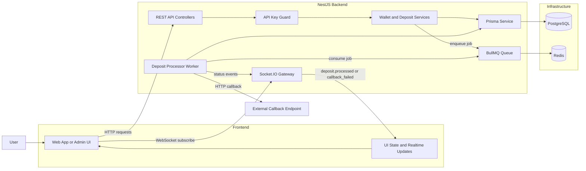

# Architecture Explanation

## Full System Diagram

## Main Parts

- NestJS handles HTTP APIs and WebSocket connections.
- PostgreSQL stores wallets and transactions.
- Redis backs the BullMQ queue.
- Prisma is used for database access.

## Flow

1. A client sends a deposit request.
2. The API stores a pending transaction.
3. A BullMQ worker processes the job.
4. The system updates the transaction status.
5. A callback and WebSocket event are sent.

## Modules

- `wallets`: wallet creation and lookup
- `deposits`: deposit ingestion and processing
- `prisma`: database access
- `common`: shared guard logic
